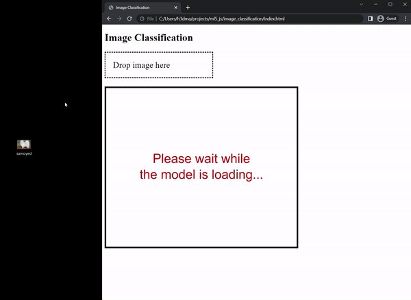
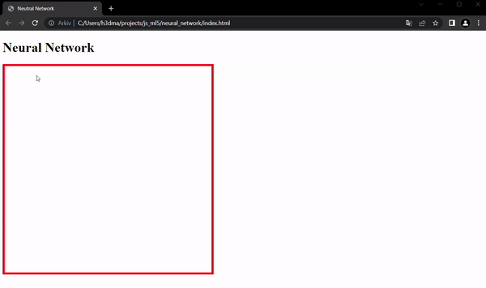
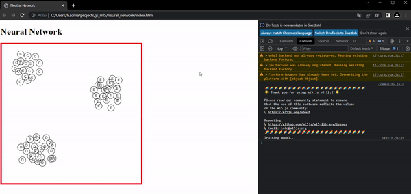
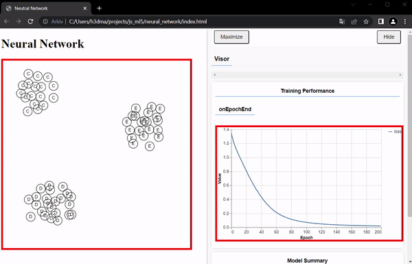

# Machine learning with ml5.js
Trying out the ml5.js library (https://ml5js.org/). 

## Animal Classification
A convolutional Neural Network for image classification. Here's a list of the model has been trained to recognize: https://github.com/ml5js/ml5-library/blob/main/src/utils/IMAGENET_CLASSES.js. 

## Neural Network
Neural network that is trained on user input to classify points on a plane.

### Data Collection
Place characters within the square. Characters are placed by clicking the desired character on the keyboard and the placing it with a mouse click. Make sure to place at least two types of characters before training the model. 

### Model Training
When done with the character placement, start the training provess by pressing ENTER.

### Predictions
After the training is done, the user can now click the square to plot predictions generated by the model.

